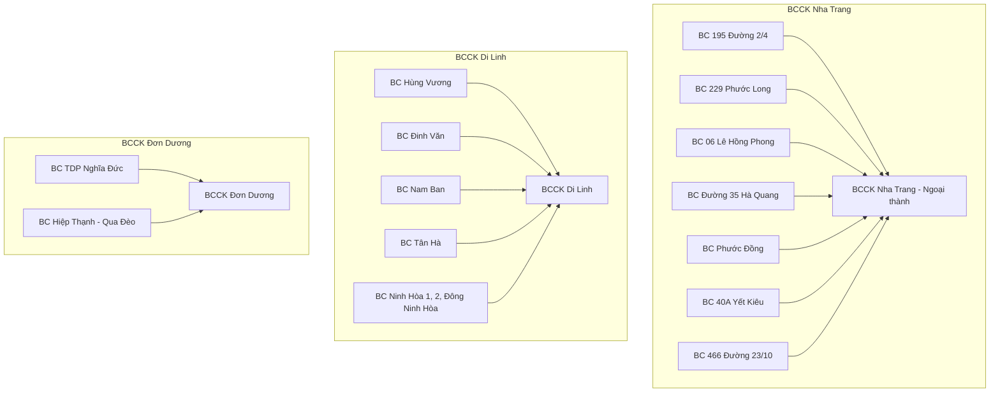

# BÁO CÁO PHƯƠNG ÁN THÀNH LẬP VÀ ĐÁNH GIÁ NĂNG LỰC CÁC BƯU CỤC CỒNG KỀNH (BCCK)
## KHUNG PHƯƠNG ÁN H2/2026 — VÙNG NAM TRUNG BỘ (NTB)

---

## I. GIỚI THIỆU CHUNG
Nhằm đáp ứng tốc độ tăng trưởng của nhóm hàng nặng cồng kềnh (≥ 10kg) tại vùng Nam Trung Bộ (NTB) trong nửa cuối năm 2026, Vùng đề xuất mô hình phân tách vận hành: **Chuyển dịch toàn bộ hàng cồng kềnh (≥ 10kg) từ các bưu cục truyền thống (BC thường) về xử lý tập trung tại 04 Bưu cục Cồng kềnh (BCCK) chuyên biệt:**
1.  **BCCK Nha Trang** (Gom 07 bưu cục khu vực Nha Trang)
2.  **BCCK Di Linh** (Gom 07 bưu cục khu vực Ninh Hòa & Lâm Hà & Di Linh)
3.  **BCCK Đơn Dương** (Gom 02 bưu cục khu vực Đơn Dương & Hiệp Thạnh)
4.  **BCCK Đức Linh - Bình Thuận** (Gom bưu cục Đức Linh)

Báo cáo này phân tích chi tiết về **Khoảng lệch Năng lực (GAP)** và **Phương án bố trí địa lý/vận hành** để chứng minh tính khả thi trước Ban giám đốc công ty.

---

## II. PHẦN 1: CHỨNG MINH NĂNG LỰC & PHÂN TÍCH GAP (KHOẢNG LỆCH)
Để chứng minh năng lực vận hành cần bổ sung, chúng tôi sử dụng mô hình dự báo để tính toán số xe tải 1.9 Tấn cần thiết dựa trên sản lượng thực tế của bưu cục (sourced từ sheet 0.3 Bưu cục Detail) hàng tháng.

### 1. Công thức và Cơ sở tính toán GAP
*   **Tổng nhu cầu thực tế ngày (T) =** Sản lượng mới nhận ngày (T) + Tồn giao lại lần 1 (ngày T-1 chuyển qua) + Tồn giao lại lần 2 (ngày T-2 chuyển qua).
*   **Năng lực vận hành thực tế ngày =** Số xe xếp thực tế × Năng suất giao thành công (GTC) kỳ vọng/chuyến (Ngày thường: 47 đơn/xe/chuyến).
*   **GAP vận hành =** Năng lực vận hành thực tế − Tổng nhu cầu thực tế.
*   **Quy đổi từ Chuyến xe sang Đầu xe tải:** Xe đề xuất (min) trong công thức AOP thực chất là **Số chuyến xe (trips)** cần chạy để giao hết sản lượng. Trong thực tế vận hành tại vùng, **mỗi xe tải 1.9 Tấn chạy 2 chuyến/ngày** (1 chuyến Ca 1 + 1 chuyến Ca 2). Do đó, số đầu xe tải thực tế cần thuê/bố trí bằng **Số chuyến xe / 2**.
*   **Cơ sở dữ liệu:** Ngày thường sản lượng được phân bổ đều bằng cách chia tổng sản lượng tháng trong sheet **`0.3 Bưu cục Detail`** cho 30 ngày làm việc.

### 2. Số liệu dự báo GAP và Nhu cầu nguồn lực chuyên dụng (Xe tải 1.9 Tấn)
Dựa trên sản lượng bưu cục thực tế (≥10kg), dự báo nhu cầu xử lý và số lượng xe tải 1.9 Tấn tối thiểu cần trang bị tại 4 BCCK như sau:

| Chỉ số vận hành (Bản Bưu Cục Detail) | Tháng 7 | Tháng 10 | Tháng 12 |
| :--- | :---: | :---: | :---: |
| **BCCK Nha Trang** | | | |
| - Sản lượng trung bình/ngày | 1.043 đơn | 1.208 đơn | 1.390 đơn |
| - Nhu cầu chuyến xe/ngày | **18 chuyến** | **21 chuyến** | **24 chuyến** |
| - **Số đầu xe tải 1.9T tương ứng (2 chuyến/ngày)** | **9 xe** | **11 xe** | **12 xe** |
| **BCCK Di Linh** | | | |
| - Sản lượng trung bình/ngày | 624 đơn | 688 đơn | 804 đơn |
| - Nhu cầu chuyến xe/ngày | **11 chuyến** | **12 chuyến** | **14 chuyến** |
| - **Số đầu xe tải 1.9T tương ứng (2 chuyến/ngày)** | **6 xe** | **6 xe** | **7 xe** |
| **BCCK Đơn Dương** | | | |
| - Sản lượng trung bình/ngày | 211 đơn | 241 đơn | 278 đơn |
| - Nhu cầu chuyến xe/ngày | **4 chuyến** | **4 chuyến** | **5 chuyến** |
| - **Số đầu xe tải 1.9T tương ứng (2 chuyến/ngày)** | **2 xe** | **2 xe** | **3 xe** |
| **BCCK Đức Linh - Bình Thuận** | | | |
| - Sản lượng trung bình/ngày | 166 đơn | 195 đơn | 223 đơn |
| - Nhu cầu chuyến xe/ngày | **3 chuyến** | **4 chuyến** | **4 chuyến** |
| - **Số đầu xe tải 1.9T tương ứng (2 chuyến/ngày)** | **2 xe** | **2 xe** | **2 xe** |

> [!WARNING]
> **Chứng minh năng lực trước hoài nghi của Công ty:**
> Việc thành lập BCCK chuyên dụng giúp gom sản lượng đạt quy mô tối ưu (Scale of Economy) để sử dụng hiệu quả đội xe tải 1.9 Tấn chặng cuối, triệt tiêu hoàn toàn lượng hàng tồn ứ, đảm bảo chỉ số KPI GTC đạt mức cam kết trên toàn vùng.

## III. PHẦN 2: LÝ DO LỰA CHỌN VÀ PHƯƠNG ÁN GOM TUYẾN
Nhiều ý kiến nghi ngại việc gom nhiều bưu cục cũ về một bưu cục cồng kềnh duy nhất sẽ làm địa bàn quá rộng, khiến nhân sự giao hàng (shipper) không thể cover được hết tuyến. Dưới đây là lý do chiến lược và phương án phân bổ tuyến cho từng BCCK:

### 1. BCCK Nha Trang (Xử lý tập trung bưu cục nội đô về kho ven đô)
*   **Vị trí lựa chọn:** Đặt kho tại khu vực ven đô (ngoại thành Nha Trang).
*   **Lý do lựa chọn:**
    *   **Tối ưu chi phí mặt bằng:** Giá thuê mặt bằng nội thành rất đắt đỏ, kho ngoại thành rộng rãi có giá rẻ hơn từ **50% - 60%**, rất phù hợp làm kho hàng nặng vốn đòi hỏi diện tích lưu trữ rộng lớn để xếp hàng cồng kềnh (mật độ lưu kho bulky chỉ đạt 3.3 đơn/m²).
    *   **Khoảng cách di chuyển hợp lý:** Phạm vi TP. Nha Trang có chiều sâu địa lý tương đối nhỏ. Kho ven đô giao đi vào các quận nội thành chỉ mất từ **15 - 25 phút di chuyển**, hoàn toàn nằm trong bán kính phục vụ tối ưu của xe tải 1.9 Tấn.
    *   **Giải phóng quá tải bưu cục cũ:** Hàng cồng kềnh chiếm diện tích lớn làm nghẽn toàn bộ luồng hàng nhỏ của 7 bưu cục cũ. Đưa hàng bulky ra kho ngoại thành giúp các bưu cục nội đô hoạt động thông thoáng hơn cho mảng Ecom nhẹ.

### 2. BCCK Di Linh (Vận hành hỗn hợp cho địa bàn rộng lớn)
*   **Vị trí lựa chọn:** Trung tâm khu vực Di Linh - Lâm Đồng.
*   **Lý do lựa chọn:**
    *   **Đặc thù địa hình:** Di Linh và vùng phụ cận (Ninh Hòa, Lâm Hà) có địa bàn rất rộng, khoảng cách giữa các tuyến giao xa hơn.
    *   **Giải pháp vận hành hỗn hợp (Hàng nhỏ + Hàng lớn):** Khác với Nha Trang chỉ chuyên bulky, BCCK Di Linh sẽ vận hành tích hợp cả hàng nhỏ và hàng lớn. Việc này giúp tối ưu hóa chi phí cố định của kho.
    *   **Chia tuyến giao thông minh:** Sử dụng xe tải 1.9 Tấn làm nhiệm vụ trung chuyển (linehaul) từ BCCK Di Linh thả hàng tại các điểm tập kết vệ tinh dọc tuyến xa, sau đó shipper nội tuyến phụ trách phát hàng chặng cuối (Last-mile). Điều này đảm bảo shipper không phải chạy quãng đường quá xa quay lại kho lấy hàng.

### 3. BCCK Đơn Dương (Khắc phục nút thắt địa hình - Qua Đèo)
*   **Vị trí lựa chọn:** Bưu cục TDP Nghĩa Đức - Thạnh Mỹ - Đơn Dương.
*   **Lý do lựa chọn:**
    *   **Vượt đèo hiểm trở:** Tuyến giao giữa Đơn Dương và Đức Trọng (Hiệp Thạnh) bị ngăn cách bởi cung đường đèo dốc hiểm trở, thời tiết sương mù, trơn trượt.
    *   **Cắt giảm chi phí chành xe:** Hiện tại, chi nhánh đang phải thuê ngoài dịch vụ chành xe tư nhân để trung chuyển hàng nặng qua đèo với chi phí rất cao và không chủ động được thời gian giao nhận (ảnh hưởng nghiêm trọng đến chỉ số KPI Giao thành công).
    *   **Sử dụng xe tải 1.9T nội bộ:** Việc thành lập BCCK Đơn Dương và trang bị xe tải 1.9 Tấn chạy cố định giúp chủ động tự vận chuyển qua đèo một cách an toàn, kiểm soát 100% thời gian giao nhận, cắt giảm hoàn toàn chi phí thuê chành xe ngoài.

### 4. BCCK Đức Linh - Bình Thuận (Quy hoạch cụm bán sơn địa)
*   **Vị trí lựa chọn:** Gom bưu cục Xã Nam Chính về BCCK Đức Linh.
*   **Lý do lựa chọn:** Quy hoạch cụm bưu cục vệ tinh khu vực Đức Linh để gom sản lượng đạt điểm hòa vốn vận hành xe tải 1.9 Tấn, nâng cao tỷ lệ gán giao hàng nặng tại khu vực giáp ranh Đồng Nai - Bình Thuận.

---

## IV. PHẦN 3: PHƯƠNG ÁN VẬN HÀNH ĐI GIAO & KHẢ NĂNG COVER TUYẾN CỦA NHÂN SỰ
Để đập tan hoài nghi của công ty về việc *"shipper có cover nổi địa bàn gom quá rộng hay không?"*, Vùng đề xuất quy trình vận hành chặng cuối sử dụng **Xe tải 1.9 Tấn** kết hợp **Mô hình Trạm trung chuyển vệ tinh (Hub-and-Spoke)**:

### 1. Sơ đồ quy trình vận hành chặng cuối
1.  **Phân loại chặng đầu tại BCCK:** Hàng bulky ≥ 10kg được gom về BCCK chuyên biệt, phân loại sẵn theo tuyến giao.
2.  **Trung chuyển bằng xe tải 1.9T (Hub-to-Spoke):** 
    *   Đối với các tuyến nội thị ven kho: Shipper nhận hàng trực tiếp tại BCCK.
    *   Đối với các tuyến xa (ví dụ: các tuyến thuộc Lâm Hà chuyển về Di Linh, hoặc tuyến Hiệp Thạnh về Đơn Dương): Xe tải 1.9 Tấn của công ty chở hàng bulky đã phân tuyến đến các **Bưu cục vệ tinh cũ (Spoke)** hoặc điểm trung chuyển cố định.
3.  **Shipper nhận hàng chặng cuối tại điểm vệ tinh:** Shipper chặng cuối nhận hàng trực tiếp từ xe tải 1.9 Tấn tại các điểm vệ sinh này và đi giao trực tiếp cho khách hàng nội vùng.

### 2. Lợi ích chứng minh khả năng giao hàng thành công (KPI GTC):
*   **Shipper không bị kiệt sức:** Shipper của các tuyến xa không cần di chuyển hàng chục km từ khu vực giao về BCCK để lấy hàng nặng. Đoạn đường dài đã có xe tải 1.9 Tấn đảm nhiệm.
*   **Năng suất giao hàng nặng vượt trội:** Sử dụng đội shipper chuyên biệt chạy xe lôi/xe ba gác hoặc đi bộ giao hàng theo cụm từ điểm vệ tinh giúp tăng năng suất giao bulky lên mức **47 - 64 đơn/shipper/ngày**, thay vì shipper thường chỉ giao được 10-15 đơn bulky/ngày do vướng hàng nhẹ Ecom.
*   **An toàn hàng hóa:** Tránh tối đa hư hỏng, vỡ nát hàng hóa cồng kềnh khi vận chuyển chặng xa bằng xe máy thông thường.

---

## V. PHƯƠNG ÁN ĐỊNH BIÊN NHÂN SỰ CHO MỖI BCCK
Để tối ưu hóa chi phí vận hành cố định và đảm bảo tính khả thi cao nhất, Vùng đề xuất định biên nhân sự chi tiết cho từng bưu cục dựa trên sản lượng thực tế (Topline volume H2/2026) và số lượng tài xế/shipper thực tế đang vận hành tại các kho nặng (lấy số liệu từ báo cáo GTC thực tế):

*   **BCCK Nha Trang (Sản lượng 1.388 đơn/ngày):** Quy mô **15 nhân sự**, bao gồm:
    *   **13 Nhân viên giao hàng (Shipper cồng kềnh):** Phụ trách giao hàng siêu nặng (≥ 20kg) và các tuyến đặc thù. (Sản lượng hàng cồng kềnh vừa 10-20kg được phân rã về bưu cục thường chặng chót cho shipper thường đi xe máy, tránh quá tải).
    *   **01 Nhân viên xử lý kho (NVXL):** Phụ trách trung chuyển, phân loại và quét mã nhận/giao chặng cuối.
    *   **01 Nhân sự quản lý / điều phối:** Quản lý chung bưu cục, điều phối đội xe và hành chính QC.
*   **BCCK Di Linh (Sản lượng 805 đơn/ngày):** Quy mô **14 nhân sự**, bao gồm:
    *   **12 Nhân viên giao hàng (Shipper cồng kềnh)**
    *   **01 Nhân viên xử lý kho (NVXL)**
    *   **01 Nhân sự quản lý / điều phối**
*   **BCCK Đơn Dương (Sản lượng 278 đơn/ngày):** Quy mô **10 nhân sự**, bao gồm:
    *   **08 Nhân viên giao hàng (Shipper cồng kềnh)**
    *   **01 Nhân viên xử lý kho (NVXL)**
    *   **01 Nhân sự quản lý / điều phối**
*   **BCCK Đức Linh - Bình Thuận (Sản lượng 223 đơn/ngày):** Quy mô **7 nhân sự**, bao gồm:
    *   **05 Nhân viên giao hàng (Shipper cồng kềnh)**
    *   **01 Nhân viên xử lý kho (NVXL)**
    *   **01 Nhân sự quản lý / điều phối**

**Tổng cộng định biên toàn vùng: 46 nhân sự** (bao gồm 38 Shipper, 4 NVXL, 4 Quản lý).
*   **Định mức lương:** Áp dụng mức lương bình quân đồng nhất **15.000.000đ/người/tháng** cho toàn bộ các vị trí (liên kết trực tiếp ô B15 trong AOP).
*   **Hiệu quả tài chính:** Việc định biên theo thực tế vận hành và phân rã hàng giúp giảm tổng số nhân sự từ 60 người (ở phương án cũ cào bằng 15 người/BC) xuống còn **46 người**, giúp tiết kiệm được **210.000.000đ/tháng** quỹ lương cho Vùng (tương đương tiết kiệm **1.26 tỷ đồng** trong 6 tháng cuối năm H2/2026), nâng cao tỷ suất lợi nhuận vận hành trên mỗi đơn hàng.

---

## VI. KẾT LUẬN & KIẾN NGHỊ
Phương án thành lập 4 BCCK tại NTB không những giải quyết bài toán tăng trưởng sản lượng hàng nặng của công ty mà còn mang lại hiệu quả tài chính rõ rệt thông qua việc tối ưu chi phí thuê ngoài (chành xe) và chi phí mặt bằng nội đô đắt đỏ.

Kính trình Ban giám đốc phê duyệt ngân sách triển khai cho 4 BCCK theo số liệu chi tiết trong AOP đã lập tại [AOP_MAU_NTB_Cach1_Dung.xlsx](file:///C:/Users/lap4all/Downloads/AOP_MAU_NTB_Cach1_Dung.xlsx).
